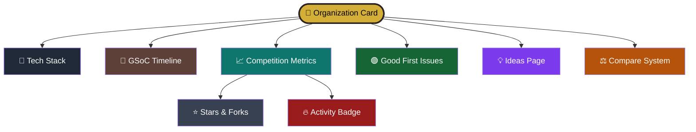

<div align="center">

# 🚀 GSoC 2026 Org Finder

## Find your perfect Google Summer of Code 2026 organization

Discover organizations based on **tech stack, domains, competition level, GitHub activity, and beginner-friendly issues** — all in one place.

<p align="center">
  <a href="https://findmygsoc.vercel.app/">
    
  </a>
  
  <a href="https://discord.gg/Kwj76sCzp">
    
  </a>
</p>

<p align="center">
  
  
  
  

</p>


</div>

---
## ✨ What is this?

GSoC 2026 Org Finder is a fast, modern, and beginner-friendly platform for exploring Google Summer of Code organizations based on tech stack, domains, interests, and contribution goals.

Instead of manually browsing through **184+ organizations**, users can:

- 🔍 Search by technology, domain, or keyword  
- 🏷️ Filter by languages, categories, and competition level  
- ⚖️ Compare organizations side-by-side  
- 🟢 Discover beginner-friendly Good First Issues  
- 📈 Track live GitHub activity and project insights  

Built with a responsive and lightweight architecture, the platform delivers a seamless experience across desktop and mobile devices.

> No sign-up. No setup. Just explore, compare, and begin your open-source journey 🚀

---

<div align="center">

## 📖 Table of Contents

| Section | Description |
|----------|-------------|
| [✨ What is this?](#-what-is-this) | Overview of the project |
| [🎯 Features](#-features) | Core functionalities and highlights |
| [📈 Flowchart](#-flowchart) | Visual representation of project workflow |
| [📁 Project Structure](#-project-structure) | Repository folder structure |
| [🔍 URL Validation](#-url-validation) | URL validation system and checks |
| [🚀 Deploy Your Own](#-deploy-your-own) | Deployment and setup guide |
| [🐛 Troubleshooting](#-troubleshooting) | Common issues and fixes |
| [🤝 Contributing](#-contributing) | Contribution guidelines and workflow |
| [👥 GSSoC Mentors](#-gssoc-mentors) | Mentors supporting the project |
| [📅 Key Dates](#-gsoc-2026-key-dates) | Important GSoC 2026 timeline |
| [💡 Tips for Users](#-tips-for-users) | Helpful usage tips and shortcuts |
| [📄 License](#-license) | Project license information |

</div>

---

## 📈 Flowchart


---

# 🎯 Features

<div align="center">

## 🎯 Features at a Glance

| ✨ Feature | 📖 Description |
|-----------|----------------|
| 🔍 Smart Search | Search across 184+ organizations |
| 🏷️ Advanced Filters | Filter by domains and languages |
| ⚖️ Organization Compare | Compare up to 3 organizations |
| 🟢 Good First Issues | Find beginner-friendly issues |
| ⌨️ Keyboard Navigation | Full accessibility support |
| 🌙 Dark Mode | Clean dark/light interface |
| 📱 Fully Responsive | Works on all screen sizes |

</div>

---

## 🔎 Discovery & Filtering

Easily explore organizations using powerful and beginner-friendly filtering tools designed to simplify the GSoC organization discovery process.

| Feature | Description |
|---------|-------------|
| 🔍 Full-text Search | Search organizations by name, tech stack, or topic |
| 🏷️ Language Filters | Filter using multiple programming languages |
| 📊 Competition Filter | Explore high, medium, or low competition orgs |
| 🟢 Activity Badges | Identify actively maintained organizations |
| ⚡ Quick Category Chips | Instantly filter by domains and interests |
| 🌱 Beginner Recommendations | Discover newcomer-friendly organizations |

---

## 📊 Live GitHub Integration

| Feature | Description |
|----------|-------------|
| 🌟 **Live GitHub Stats** | View Stars, Forks, Issues, and Last Commit data |
| 🟢 **Good First Issues** | Track beginner-friendly issues on every org card |
| 🎖️ **Activity Badge** | Shows Active, Moderate, or Low repository activity |
| 🔗 **Smart Repo Links** | Redirects to project repos or GitHub org pages |
| 📈 **Project Insights** | Analyze repository health and activity |
| ⚡ **Fast Fetching** | Lightweight and optimized GitHub integration |

---


---

## ⚖️ Comparison System

Easily compare up to **3 organizations side-by-side** to identify the best fit for your skills and contribution goals.

| Metric | Comparison |
|--------|-------------|
| 📊 Competition | High, medium, or low competition |
| 📅 GSoC Experience | Years participating in GSoC |
| ⭐ GitHub Stats | Stars, forks, and activity |
| 🟢 Good First Issues | Beginner-friendly opportunities |
| 💻 Tech Stack | Languages and domains |
| 🔥 Repository Health | Activity and maintenance status |

---

# ✨ User Experience Features

<table>
<tr>

<td align="center" width="25%">

### ⌨️ Smart Navigation

```text
┌─────────────────┐
│ ↑ ↓ ← → Navigate│
│ Enter → Open    │
│ C → Compare     │
│ Esc → Close     │
└─────────────────┘
```

⚡ Fast keyboard-first browsing

</td>

<td align="center" width="25%">

### 📊 Local Analytics

```text
┌─────────────────┐
│ 👀 Org Views    │
│ 🔎 Searches     │
│ ⏱ Session Time  │
│ 📈 Trends       │
└─────────────────┘
```

🔒 100% private browser storage

</td>

<td align="center" width="25%">

### 🌙 Theme Engine

```text
┌─────────────────┐
│ ☀️ Light Mode   │
│        ⇅        │
│ 🌙 Dark Mode    │
└─────────────────┘
```

💾 Preferences saved automatically

</td>

<td align="center" width="25%">

### 📱 Responsive UI

```text
┌─────────────────┐
│ 💻 Desktop      │
│ 📟 Tablet       │
│ 📱 Mobile       │
└─────────────────┘
```

⚡ Optimized for all screen sizes

</td>

</tr>
</table>

---

## 🗂️ All 184 GSoC 2026 Organizations

| Domain | Examples |
|---|---|
| Science & Medicine | OpenAstronomy, DeepChem, MDAnalysis, ArduPilot, CERN-HSF |
| Programming Languages | LLVM, GCC, Haskell.org, The Rust Foundation, Swift, Python SF |
| Data | MariaDB, PostgreSQL, DBpedia, OpenStreetMap, MetaBrainz |
| Web | Django, Drupal, Wagtail, Wikimedia, webpack |
| Security | Metasploit, OWASP, Rizin, AFLplusplus, The Honeynet Project |
| Operating Systems | Debian, FreeBSD, GNOME, NetBSD, Haiku, KDE |
| Media | FFmpeg, Blender, Synfig, Jitsi, VideoLAN |
| Infrastructure | Kubeflow, KubeVirt, QEMU, Meshery, CNCF |
| Dev Tools | MIT App Inventor, OpenVINO, Gemini CLI, API Dash |
| Other | AnkiDroid, Joplin, Zulip, CCExtractor, Neovim |

---

## 🛠️ Tech Stack

| Layer | What |
|---|---|
| Frontend | Vanilla HTML/CSS/JS — zero frameworks, zero build step |
| Hosting | Vercel (static) |
| API | Vercel Edge Function (`/api/github.js`) |
| Data source | Manually curated from [summerofcode.withgoogle.com](https://summerofcode.withgoogle.com/programs/2026/organizations) |
| Analytics | Browser `localStorage` only — no external tracking |

---

## 📁 Project Structure

```
gsoc-2026-org-finder/
├── index.html                    # Main frontend HTML
├── api/github.js                 # Vercel Edge Function — GitHub API proxy
├── src/
│   ├── assets/og-image.jpeg      # Social preview image
│   ├── js/app.js                 # Application logic
│   ├── js/org.js                 # Organization data source
│   └── styles.css                # Styling
├── agent/
│   ├── scripts/                  # Automation and helper scripts
│   └── tenet_agent/              # TENET PR review agent
├── data/issues.json
└── README.md
```

No `node_modules`. No build step. No bundler. Just deploy.

---

## 🔍 URL Validation

The project includes a validation script to ensure all organization ideas URLs are safe and properly formatted:

```bash
node agent/scripts/validate-ideas-urls.js
```

This script checks:
- ✅ URL format validity
- ✅ Protocol restrictions (http/https only)
- ⚠️ Placeholder/generic URLs that need updating
- 📊 Summary statistics and protocol distribution

Run this before committing changes to `src/js/org.js` to catch invalid URLs early.

## 🔒 Hardened Frontend Architecture

To ensure the GSoC Org Finder is extremely secure, accessible, resilient, and maintainable, the codebase has been hardened with a robust vanilla architecture:

### 1. Unified Event-Driven Flow & Delegation (100% Programmatic & CSP-Compliant)
All frontend scripting, bookmarking, complexity filtering, modal controls, and dynamic templates have been migrated to a 100% programmatic model:
* **Zero Inline Handlers:** All scattered `onclick` and `onerror` attributes in both static HTML (`index.html`) and dynamic template strings (`app.js`, `recommendation-ui.js`) are completely eliminated.
* **Global Capturing Image Error Interceptor:** A centralized recapturing `error` listener registered on `document` seamlessly intercepts failed image load events and triggers styled initial-based fallbacks.
* **Centralized Event Delegation:** Dynamic interactive collections (like trending cards, selected language badges, and mentor contact cards) cleanly route clicks via unified delegated listeners on their parent elements (`#trendingScroll`, `#selectedLangsStrip`, `#mentorsContainer`).

### 2. 🛡️ Safe Rendering & Sanitization (XSS Mitigation)
* **HTML Escaping:** All dynamic insertions of user-supplied or external API content are safely wrapped via a rigid `escapeHtml()` text filter to block HTML markup injections.
* **Protocol-Restricted Hrefs:** External anchor elements (like organization repository pages or ideas boards) are strictly validated via `sanitizeHrefUrl()` and `validateIdeasUrl()` to enforce only safe absolute protocols (`http:` and `https:`), explicitly rejecting active protocol wrappers (`javascript:`, `data:`, `vbscript:`).

### 3. ♿ Accessible Modal Management
All overlays (`orgModal`, `compareModal`, and `helpModal`) implement full semantic accessibility matching the WAI-ARIA standard:
* Modals are marked up using `role="dialog"`, `aria-modal="true"`, and mapped with specific label headers via `aria-labelledby`.
* Open/close interactions trigger strict **focus restoration** (returning focus to the activating button upon closing).
* Modals implement dynamic **focus trapping** ensuring `Tab`/`Shift+Tab` operations cycle exclusively within dialog controls.

### 4. 🛜 Offline Resilience (Service Worker Caching)
* **Static Manifest:** A robust cache list (`sw.js`) collects and version-controls all essential UI assets, scripts, stylesheets, and custom Google Fonts.
* **Dual Caching Interceptors:** Intercepted requests deploy **Stale-While-Revalidate** patterns for static assets (for zero-latency responsiveness) and **Network-First** strategies for Edge proxy stats and JSON issue lists (for high data reliability).

### 5. 🧪 Zero-Dependency Testing Suite
A modular test bed under `/tests` utilizes Node.js's built-in `node:test` framework and mock DOM stubs, covering:
* `tests/sanitization.test.js`: Validates escaping and URL sanitizers.
* `tests/skills.test.js`: Validates language aliases and technical context matching for single-letter tags.
* `tests/recommendation.test.js`: Validates recommender scores and veteran status bonuses.
* `tests/filtering.test.js`: Validates tag matching.
* `tests/modal.test.js`: Upgraded interactive test suite validating focus traps, focus restorations, and API fetching.
* `tests/browser.test.js`: Simulated browser DOM smoke test dry-running page load event bindings.
* `tests/cache.test.js`: Service Worker offline caching strategy fetch intercept test.

Run the test suite locally:
```bash
npm test
```

## 🚀 Deploy Your Own

### 1. Fork & Clone
```bash
git clone https://github.com/your-username/gsoc-2026-org-finder.git
cd gsoc-2026-org-finder
```

### 2. Add GitHub Token (for live stats + Good First Issues)
In your Vercel dashboard → Project Settings → Environment Variables:
```
GITHUB_TOKEN = ghp_your_token_here
```
Generate a token at [github.com/settings/tokens](https://github.com/settings/tokens) — only `public_repo` scope needed.

### 3. Deploy
```bash
vercel --prod
```
Or connect the repo to Vercel and it deploys automatically on every push.

### 4. Run Locally
```bash
open index.html   # macOS — works without API (GitHub stats won't load)
```
For full functionality locally, run `vercel dev` to start the Edge Function.

---

## 🐛 Troubleshooting

**GitHub stats not loading?**
- Set `GITHUB_TOKEN` environment variable
- Check rate limits: `curl -H "Authorization: token YOUR_TOKEN" https://api.github.com/rate_limit`

**Ideas link not working?**
- Run `node agent/scripts/validate-ideas-urls.js` to check all URLs

**Issues page empty?**
- GitHub API might be rate-limited; wait 1 hour and refresh

---

## 🤝 Contributing

Found a missing org, wrong category, or incorrect tags? PRs are very welcome!

**Read the guide for your contribution track before getting started:**

| Track | Guide |
|-------|-------|
| GSSoC'26 Contributors | [GSSoC Contributor Guide](docs/GSSOC_CONTRIBUTOR_GUIDE.md) |
| GSSoC'26 Mentors | [GSSoC Mentor Guide](docs/GSSOC_MENTOR_GUIDE.md) |
| NSoC'26 Contributors | [NSoC Guide](docs/NSOC_GUIDE.md) |
| General Contributors | [General Contributor Guide](docs/GENERAL_CONTRIBUTOR_GUIDE.md) |

For the full contributing reference (architecture, rules, PR workflow), see [CONTRIBUTING.md](CONTRIBUTING.md).

### Assignment Process

This repo uses a **maintainer-verified** assignment system:

1. Find an issue and comment `/assign gssoc` or `/assign nsoc`
2. Your request is **queued** (not immediately assigned)
3. A maintainer verifies the issue and runs `/approve-assignment`
4. You get notified and can begin work

**Do not start working before you are assigned.**

### Quick Start

1. Fork the repo
2. Edit the `ORGS` array in `index.html`
3. Open a pull request using the appropriate template

Each org entry looks like this:

```js
{
  name: "Organization Name",
  cat: "science",           // science | programming | data | web | os | security | media | infra | dev | other
  years: 5,                 // number of GSoC years participated
  firstYear: 2021,          // first year they participated
  competition: "moderate",  // hot | moderate | chill
  github: "owner/repo",     // main repo (or just "owner" for umbrella orgs)
  ideas: "https://github.com/org/repo/wiki/Ideas",  // project ideas page URL (optional)
  tags: ["python", "c++", "machine learning"],
  desc: "Short description of what the org does.",
  fit: ["Python devs", "ML researchers"]
}
```

**Ideas URL Requirements**:
- Must use `http://` or `https://` protocol (or protocol will be added automatically)
- Should link to the organization's specific project ideas page
- Generic GSoC organization pages are acceptable as placeholders but should be updated when possible
- Run `node agent/scripts/validate-ideas-urls.js` to check all URLs before submitting

**Competition levels** (subjective, based on org popularity + slot count):
- `hot` — high applicant volume, very competitive (Django, LLVM, Git, KDE…)
- `moderate` — good balance of applicants and slots
- `chill` — fewer applicants, easier to stand out

### PR Review Pipeline

All PRs pass through a 3-stage pipeline:

| Stage | What | Who |
|-------|------|-----|
| Stage 1 | DCO, format, AI/slop, diff size | Automated |
| Stage 2 | Code review, quality | Mentor |
| Stage 3 | Final merge decision | Project Admin |

Stage 2 unlocks only after Stage 1 passes. The pipeline status comment on your PR updates only when the stage actually changes (no spam).

---

## 📅 GSoC 2026 Key Dates

| Date | Milestone |
|---|---|
| February 2026 | Organizations announced |
| **March 16, 2026** | **Student applications open** |
| **March 31, 2026** | **Application deadline** |
| April 30 2026 | Accepted students announced |
| May – November 2026 | Coding period |

---

## 🔌 API Reference (`/api/github.js`)

The Edge Function proxies GitHub API calls so your token never hits the client.

| Endpoint | Description |
|---|---|
| `GET /api/github?repo=owner/repo` | Repo stats: stars, forks, issues, last commit, activity, GFI count |
| `GET /api/github?repo=owner/repo&gfi=1` | Good First Issue count only (faster, cached separately) |
| `GET /api/github?repo=owner/repo&gfi=1&issues=1` | Full list of up to 30 open Good First Issues |

All responses are cached in-memory for **1 hour** on the Edge runtime.
# 🚀 Official Open Source Program Project

<div align="center">

## 🌟 Proudly Participating In

## Nexus Spring of Code 2026 (NSoC'26)  
## GirlScript Summer of Code 2026 (GSSoC'26)


--- 

</div>

## 🔑 Project Admin

<a href="https://github.com/S3DFX-CYBER"></a>

**[@S3DFX-CYBER](https://github.com/S3DFX-CYBER)** — Project Admin (PA) for GSSoC'26 and NSoC'26. Responsible for final merge decisions, mentor coordination, repository maintenance, and ensuring contribution quality across all programs.

---

## 👥 GSSoC Mentors

These mentors help guide and review contributions for the GSSoC program:

<!-- GSSOC_MENTORS_START -->
<a href="https://github.com/12fahed"></a>
<a href="https://github.com/4f4d"></a>
<a href="https://github.com/aanjalii01"></a>
<a href="https://github.com/adithyan-css"></a>
<a href="https://github.com/AditthyaSS"></a>
<a href="https://github.com/AnirbansarkarS"></a>
<a href="https://github.com/AnirudhPhophalia"></a>
<a href="https://github.com/anubhavxdev"></a>
<a href="https://github.com/Anushreebasics"></a>
<a href="https://github.com/aryanbhutani26"></a>
<a href="https://github.com/ayu-yishu13"></a>
<a href="https://github.com/Ayush-Patel-56"></a>
<a href="https://github.com/Ayushh-Sharmaa"></a>
<a href="https://github.com/Balaji91221"></a>
<a href="https://github.com/BandhiyaHardik"></a>
<a href="https://github.com/coder-zs-cse"></a>
<a href="https://github.com/CoderOggy78"></a>
<a href="https://github.com/deepak0x"></a>
<a href="https://github.com/deepaksinghh12"></a>
<a href="https://github.com/DevROHIT11"></a>
<a href="https://github.com/Haile-12"></a>
<a href="https://github.com/itsdakshjain"></a>
<a href="https://github.com/JoeCelaster"></a>
<a href="https://github.com/kallal79"></a>
<a href="https://github.com/KaranGupta2005"></a>
<a href="https://github.com/knoxiboy"></a>
<a href="https://github.com/Kota-Jagadeesh"></a>
<a href="https://github.com/KumarNirupam1"></a>
<a href="https://github.com/lourduradjou"></a>
<a href="https://github.com/lovestaco"></a>
<a href="https://github.com/magic-peach"></a>
<a href="https://github.com/Manan-Chawla"></a>
<a href="https://github.com/Maxd646"></a>
<a href="https://github.com/MAYANKSHARMA01010"></a>
<a href="https://github.com/Mohit-368"></a>
<a href="https://github.com/morningstarxcdcode"></a>
<a href="https://github.com/Mrigakshi-Rathore"></a>
<a href="https://github.com/MUKUL-PRASAD-SIGH"></a>
<a href="https://github.com/Neilblaze"></a>
<a href="https://github.com/nihalawasthi"></a>
<a href="https://github.com/nitinog10"></a>
<a href="https://github.com/oasis-parzival"></a>
<a href="https://github.com/piyushdotcomm"></a>
<a href="https://github.com/Precise-Goals"></a>
<a href="https://github.com/preetbiswas12"></a>
<a href="https://github.com/rounakkraaj-1744"></a>
<a href="https://github.com/sabeenaviklar"></a>
<a href="https://github.com/Sagar-Datkhile"></a>
<a href="https://github.com/Satya900"></a>
<a href="https://github.com/saurabh24thakur"></a>
<a href="https://github.com/Shravanthi20"></a>
<a href="https://github.com/sparshagarwal0411"></a>
<a href="https://github.com/SparshM8"></a>
<a href="https://github.com/stealthwhizz"></a>
<a href="https://github.com/subratamondalnsec"></a>
<a href="https://github.com/Suvanwita"></a>
<a href="https://github.com/SyedImtiyaz-1"></a>
<a href="https://github.com/TarunyaProgrammer"></a>
<a href="https://github.com/thakurutkarsh22"></a>
<a href="https://github.com/uddalak2005"></a>
<a href="https://github.com/vanshaggarwal07"></a>
<!-- GSSOC_MENTORS_END -->

## We thank all our Contributors for improving this project

## 💡 Tips for Users

1. **New to GSoC?** Start with "Newcomers First" filter + sort by Good First Issues
2. **Experienced?** Check "Veterans" filter + sort by Competition for challenges
3. **Building a comparison?** Use keyboard shortcut `C` to quickly add orgs
4. **Mobile browsing?** Try portrait mode — everything scrolls smoothly
   
## ✨ Contributors
<!-- CONTRIBUTORS_START -->
<a href="https://github.com/0000001abhishek-debug"></a>
<a href="https://github.com/4f4d"></a>
<a href="https://github.com/AAKASH22269796"></a>
<a href="https://github.com/ANKITDANDOTIYA"></a>
<a href="https://github.com/AbhishekVinod-dev"></a>
<a href="https://github.com/Aditya-debugs141"></a>
<a href="https://github.com/Aditya8369"></a>
<a href="https://github.com/AdityaM-IITH"></a>
<a href="https://github.com/Akshayaqueen"></a>
<a href="https://github.com/Ashish241"></a>
<a href="https://github.com/Ashusf90"></a>
<a href="https://github.com/Ashvin-KS"></a>
<a href="https://github.com/Ayushi-hi"></a>
<a href="https://github.com/Ayushia5"></a>
<a href="https://github.com/Bushra-gh"></a>
<a href="https://github.com/Chizaram-Igolo"></a>
<a href="https://github.com/D4rk-Pho3nix"></a>
<a href="https://github.com/DAYHARIKA"></a>
<a href="https://github.com/Deepakvarna02"></a>
<a href="https://github.com/Dhruvil135"></a>
<a href="https://github.com/Dhruvil20060"></a>
<a href="https://github.com/Dj-Shortcut"></a>
<a href="https://github.com/G-Ganesh83"></a>
<a href="https://github.com/HarshaVardhan31012007"></a>
<a href="https://github.com/Harshith1702"></a>
<a href="https://github.com/Harxhit"></a>
<a href="https://github.com/IshitaSingh0822"></a>
<a href="https://github.com/Itheshjs"></a>
<a href="https://github.com/Itzzavdheshh"></a>
<a href="https://github.com/Jagriti-yadav"></a>
<a href="https://github.com/Jay-Jay-Tee"></a>
<a href="https://github.com/Konarksharma13"></a>
<a href="https://github.com/Kuldeeps1505"></a>
<a href="https://github.com/Lathika11"></a>
<a href="https://github.com/Manasa-2303"></a>
<a href="https://github.com/Manav5234"></a>
<a href="https://github.com/MehtabSandhu11"></a>
<a href="https://github.com/Namish06"></a>
<a href="https://github.com/Nightkilller"></a>
<a href="https://github.com/Nirula23"></a>
<a href="https://github.com/OmkarAKadam"></a>
<a href="https://github.com/Pallavi-vi-1234"></a>
<a href="https://github.com/Pranathi-Kunjeti"></a>
<a href="https://github.com/Pranav-IIITM"></a>
<a href="https://github.com/PrincePundir123"></a>
<a href="https://github.com/PriyaanshPandey"></a>
<a href="https://github.com/Rachit-Kakkad1"></a>
<a href="https://github.com/S3DFX-CYBER"></a>
<a href="https://github.com/SHUBHAM2775"></a>
<a href="https://github.com/Sha-lini3"></a>
<a href="https://github.com/ShailiBoddula"></a>
<a href="https://github.com/Shivansh181003"></a>
<a href="https://github.com/Soquixx"></a>
<a href="https://github.com/Taru-Sharma0503"></a>
<a href="https://github.com/TarunyaProgrammer"></a>
<a href="https://github.com/ThePrabhu"></a>
<a href="https://github.com/Trrr10"></a>
<a href="https://github.com/UjsGit"></a>
<a href="https://github.com/VaibhavMP"></a>
<a href="https://github.com/Vedhant26"></a>
<a href="https://github.com/Vishee02"></a>
<a href="https://github.com/Vrinda-28"></a>
<a href="https://github.com/YLaxmikanth"></a>
<a href="https://github.com/Yashvijain1234"></a>
<a href="https://github.com/a638011"></a>
<a href="https://github.com/aasthakhatri11"></a>
<a href="https://github.com/abdussamad567"></a>
<a href="https://github.com/ajitkumarsaini02"></a>
<a href="https://github.com/amrita-a-menon"></a>
<a href="https://github.com/angelina-2206"></a>
<a href="https://github.com/anirudh645"></a>
<a href="https://github.com/anshul23102"></a>
<a href="https://github.com/anushka146"></a>
<a href="https://github.com/arghya29"></a>
<a href="https://github.com/arpit2006"></a>
<a href="https://github.com/arushiranjan"></a>
<a href="https://github.com/ash1shkumar"></a>
<a href="https://github.com/bhaktiyadav08"></a>
<a href="https://github.com/bhavyanjain3004"></a>
<a href="https://github.com/bipinchaudhary28899"></a>
<a href="https://github.com/charu2210"></a>
<a href="https://github.com/chavanGaneshDatta"></a>
<a href="https://github.com/ckprojects77"></a>
<a href="https://github.com/deekshithayadav-16"></a>
<a href="https://github.com/diksha78dev"></a>
<a href="https://github.com/dishamaurya081-create"></a>
<a href="https://github.com/garimatiwari1912-alt"></a>
<a href="https://github.com/gloooomed"></a>
<a href="https://github.com/imayuss"></a>
<a href="https://github.com/jatinrwt01"></a>
<a href="https://github.com/kejriwalkaushal04"></a>
<a href="https://github.com/kiranShamsHere"></a>
<a href="https://github.com/maanyadanayak"></a>
<a href="https://github.com/maitrak18"></a>
<a href="https://github.com/mdudhe2007"></a>
<a href="https://github.com/meghna-cs"></a>
<a href="https://github.com/mohanteja781112"></a>
<a href="https://github.com/mramansayyad"></a>
<a href="https://github.com/mudit-codez"></a>
<a href="https://github.com/neeraj477"></a>
<a href="https://github.com/nimkarprachi17"></a>
<a href="https://github.com/nitinog10"></a>
<a href="https://github.com/omkartike"></a>
<a href="https://github.com/opinder8699"></a>
<a href="https://github.com/parneetbrar234-svg"></a>
<a href="https://github.com/poorvasingh1610"></a>
<a href="https://github.com/pranav-pachn"></a>
<a href="https://github.com/prisha-sh"></a>
<a href="https://github.com/rajdeep-yadav"></a>
<a href="https://github.com/riddhima25bet10005-a11y"></a>
<a href="https://github.com/riddhimagupta2"></a>
<a href="https://github.com/riyanshigupta890-cloud"></a>
<a href="https://github.com/rudra1337-dev"></a>
<a href="https://github.com/saiprasad578"></a>
<a href="https://github.com/saumyasargam"></a>
<a href="https://github.com/shivam-kakkar"></a>
<a href="https://github.com/shravanithouta108"></a>
<a href="https://github.com/shreyjoshi73"></a>
<a href="https://github.com/shrutisd739"></a>
<a href="https://github.com/shrutssss"></a>
<a href="https://github.com/srishav3"></a>
<a href="https://github.com/syedrazamd"></a>
<a href="https://github.com/v4rshh"></a>
<a href="https://github.com/vaibhavi-vaishnav"></a>
<a href="https://github.com/yuvraj-k-singh"></a>
<!-- CONTRIBUTORS_END -->

---

## Star History

<a href="https://www.star-history.com/?repos=S3DFX-CYBER%2FGSoC-Org-Finder-&type=date&legend=top-left">
 <picture>
   <source media="(prefers-color-scheme: dark)" srcset="https://api.star-history.com/chart?repos=S3DFX-CYBER/GSoC-Org-Finder-&type=date&theme=dark&legend=top-left" />
   <source media="(prefers-color-scheme: light)" srcset="https://api.star-history.com/chart?repos=S3DFX-CYBER/GSoC-Org-Finder-&type=date&legend=top-left" />
   
 </picture>
</a>

---

## 📄 License

Apache 2.0 — made for GSoC beginners, by people who've been there.
Share it with anyone applying! Applications open **March 16, 2026**. 🙌
<center>
  


</center>
